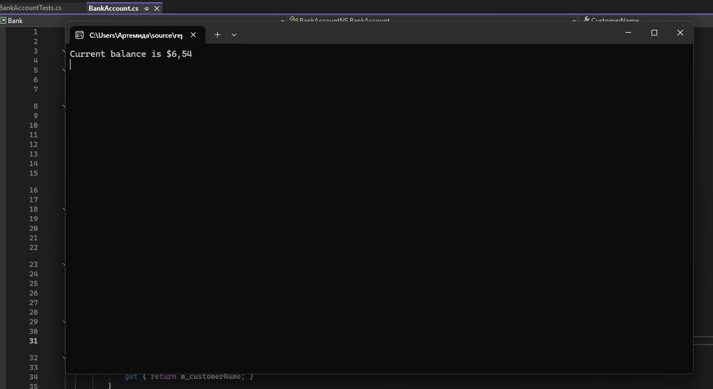
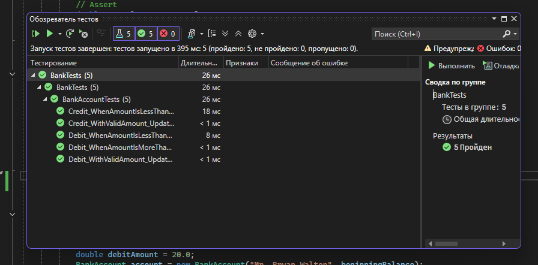

# Отчет по практической работе №6
## Создание автоматизированных unit-тестов (часть 1)
**Выполнили:** Саттарова Севара, Седиков Артём 

**Группа:** 3ИСИП-323 

**Скриншот работы приложения:**

*На скриншоте видно, что программа корректно выводит финальный баланс.*

Было создано **5 тестовых методов** для проверки методов `Debit` и `Credit` класса `BankAccount`
**Скриншот успешного выполнения всех тестов:**

Вывод:

В ходе выполнения практической работы:

- Созданы проект `Bank` и проект модульных тестов `BankTests`.
- Написаны unit-тесты, покрывающие основные сценарии работы методов `Debit` и `Credit`.
- Тестирование методом «белого ящика» позволило обнаружить логическую ошибку в методе `Debit` (неправильный знак операции).
- После исправления кода и рефакторинга (использование констант, проверка сообщений исключений) все тесты успешно проходят.

**Причины успешного/неуспешного выполнения тестов:**

- Первоначальная **неуспешность** теста `Debit_WithValidAmount_UpdatesBalance` была вызвана ошибкой в реализации метода (применение `+=` вместо `-=`).
- **Успешность** всех тестов после исправления подтверждает корректность работы методов и правильность обработки граничных случаев (отрицательные суммы, превышение баланса).

Таким образом, автоматизированное тестирование помогает своевременно выявлять дефекты и повышать надёжность программного обеспечения.
